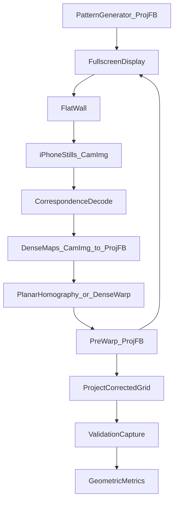

# MVP Architecture

Automatic projector–camera calibration and geometric pre-warp for:

- one projector  
- one fixed iPhone  
- flat wall  

Accuracy and reproducibility over real-time. External learned models (DINO, SAM, MoGe, YOLO, etc.) are **out of scope**.

---

## Objective

Automatically compute a **projector-space pre-warp** so a rectangular reference appears geometrically correct in the iPhone image when projected on a flat wall.

### Production flat-wall path

See `PRODUCTION_PIPELINE_SPEC.md`. Hardening status: `VALIDATION_STATE.md`.

```
discover display and camera
→ display ChArUco board
→ capture
→ detect known projector IDs in camera image
→ estimate H_cam_from_proj
→ calculate H_proj_from_cam
→ define desired target geometry (save before corrected analysis)
→ generate projector-space pre-warp
→ display corrected validation board
→ capture
→ compare detected points against the independent desired target
→ save results
```

Command: `procam-calibrate auto-wall --run-dir <run>` (default `--pipeline homography`).

No neural training is required for this path. CSPR-Net is experimental non-planar
only. GS-ProCams is `REUSABLE_COMPONENTS_ONLY`.

Shared implementation: `procam_calibrate/charuco.py` — used by calibration,
uncorrected/corrected validation, refine, and acceptance (one detector only).

### Pipeline steps (success criteria)

1. Display ChArUco calibration board  
2. Capture with iPhone  
3. Calculate camera–projector correspondences (marker IDs)  
4. Estimate planar homography  
5. Generate projector-space pre-warp  
6. Project corrected validation board  
7. Capture corrected result  
8. Measure independent geometric error numerically  
9. Save all intermediate artifacts  

---

## Paths

| Variable | Absolute path |
|----------|---------------|
| `CSPR_NET_ROOT` | `/Users/ostino/Documents/Code/Projector_studies/CSPR-Net` |
| `GS_PROCAMS_ROOT` | `/Users/ostino/Documents/Code/Projector_studies/GS-ProCams` |
| `INTEGRATION_ROOT` | `/Users/ostino/Documents/Code/Projector_studies/procam-calibration` |
| `TEST_DATA_ROOT` | `/Users/ostino/Documents/Code/Projector_studies/procam-test-data` |

Original repos stay unmodified until M1/M2 reproduction is done. Combined code lives only under `INTEGRATION_ROOT`.

---

## Architecture



### Stage ownership

| Stage | Implementation home | Repo reuse |
|-------|---------------------|------------|
| ChArUco board + detect | `INTEGRATION_ROOT` `charuco.py` | OpenCV ArUco/ChArUco |
| Capture / display | `INTEGRATION_ROOT` | See IPHONE_CAPTURE_PROTOCOL.md |
| Homography + pre-warp | `INTEGRATION_ROOT` `homography_baseline.py` | OpenCV |
| Validation metrics | `INTEGRATION_ROOT` `charuco.py` / `metrics.py` | Independent proj↔cam |
| Auto state machine | `INTEGRATION_ROOT` `auto_wall.py` | Production = homography |
| Radiometry | Deferred | GS `PEModel` / `compensate.py` after geometry |
| CSPR neural | Experimental non-planar only | Not used for flat MVP |
| GS full train | Out of flat MVP | `REUSABLE_COMPONENTS_ONLY` |

---

## Coordinate contract

See [COORDINATE_SYSTEMS.md](COORDINATE_SYSTEMS.md). Minimum:

- `cam_to_proj_*`: **CamImg → ProjFB**  
- `H_cam_from_proj`: **ProjFB → CamImg**  
- `pre_warped.png`: **ProjFB**  

---

## Artifact layout (every run)

```text
TEST_DATA_ROOT/runs/<run_id>/
  run_metadata.json
  commands.txt
  environment.txt
  projector_patterns/
  camera_captures/
  preprocessed_captures/
  correspondences/
  calibration/
  warp_maps/
  projected_validation/
  captured_validation/
  error_visualizations/
  metrics.json
  report.md
```

Never overwrite a previous `run_id`.

---

## Milestone map

| ID | Name | Exit |
|----|------|------|
| M0 | Audit | All Phase-0 docs; components identified |
| M1 | Reproduce CSPR unchanged | Meaningful output or blocker |
| M2 | Reproduce GS unchanged | Meaningful output or blocker |
| M3 | Common calibration dataset | Shared test data under `TEST_DATA_ROOT` |
| M4 | Flat-wall sparse calibration | Reproj median < 1 px (or justified limit) |
| M5 | Dense correspondence | Maps + confidence + mask saved |
| M6 | Projector pre-warp | Corrected better than uncorrected numerically |
| M7 | Residual-correction loop | Converges or documents physical limit |
| M8 | Compare/integrate repo components | Only with measured gain |
| M9 | Other surfaces | Angled → bipartite → cube → curved if supported |
| M10 | Continuous capture | After deterministic success |

---

## Flat-wall MVP status

Implementation delivered; validation hardening in progress — see
`VALIDATION_STATE.md`. Canonical reference run (immutable):
`procam-test-data/runs/flatwall_20260717_141610`.

Do not change the production homography path without measured regression.
